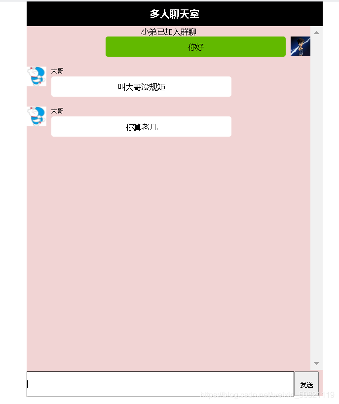
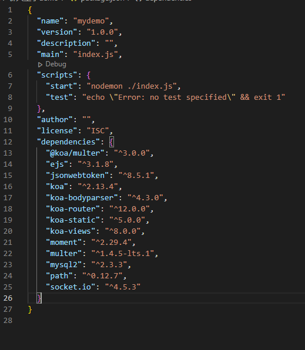

# socket.io 实现多人聊天室

## 网上看到这篇文章觉得挺有意思，看到这个效果图，于是决定自己实现一下。[参考文章](https://blog.csdn.net/weixin_50821119/article/details/115314445)

### 一、参考效果图 

### 二、设计思路图 

### 三、代码实现

#### 1.初始化项目，下载需要的依赖包，以下是整个项目的依赖文件

```js
npm init
npm i koa koa-router koa-static koa-views socket.io -S
```



#### 2.注册逻辑,前端是简单的 form 表单提交，但是这里注意，有文件上传，Content-Type 需改为'multipart/form-data'，服务器代码如下，连接了 mysql 数据库，把用户注册信息存至 student 表中

```js
const Router = require('koa-router');
const router = new Router();

const multer = require('@koa/multer');
const upload = multer({ dest: 'public/imgs' });
const conn = require('../config/db.config');

router.get('/', async (ctx, next) => {
  await ctx.render('register');
});

router.post('/', upload.single('avatar'), async (ctx, next) => {
  const { username, password } = ctx.request.body;
  const avatar = `/imgs/${ctx.file.filename}`;
  const connection = await conn();
  try {
    const [
      rows,
    ] = await connection.execute(
      'insert into student(name,password,avatar) values(?,?,?)',
      [username, password, avatar]
    );
    if (rows?.affectedRows) {
      ctx.body = {
        code: 0,
        msg: '注册成功',
      };
    }
  } catch (error) {
    ctx.body = {
      code: -1,
      msg: '注册失败，该用户已存在',
    };
  }
});

module.exports = router;
```

#### 3.登录逻辑，前端是简单的 form 表单提交，服务器代码如下

```js
const Router = require('koa-router');
const router = new Router();

const conn = require('../config/db.config');
const JWT = require('../utils/jwt');

router.get('/', async (ctx, next) => {
  await ctx.render('login');
});

router.post('/', async (ctx, next) => {
  const { username, password } = ctx.request.body;
  const connection = await conn();
  const [
    rows,
  ] = await connection.execute(
    'select * from student where name = ? and password = ?',
    [username, password]
  );
  if (rows.length) {
    const payload = {
      username,
      password,
    };
    const token = JWT.generate(payload, '1d');
    ctx.set('authorization', token);
    ctx.body = {
      code: 0,
      msg: '登录成功',
    };
  } else {
    ctx.body = {
      code: -1,
      msg: '用户名或密码错误',
    };
  }
});

module.exports = router;
```

#### 4.JWT 登录鉴权：前端在登录成功后往 localStorage 中存储服务器发送的 token，然后在每次发起请求前都把 token 带到请求头里，服务器使用应用级中间件统一处理所有接口的时候首先校验 token 是否有效，有则成功返回数据，无则返回 401。我在这里用到了 jsonwebtoken 第三方插件，封装的一个函数用于加密与解密

```js
const jwt = require('jsonwebtoken');
const secret = 'anydata'; // 秘钥

const JWT = {
  generate: (payload, expiresTime) => {
    // 签名
    return jwt.sign(payload, secret, { expiresIn: expiresTime });
  },
  verify: (token) => {
    // 解密
    try {
      return jwt.verify(token, secret);
    } catch (error) {
      return false;
    }
  },
};

module.exports = JWT;
```

#### 5.由于我写的聊天室页面没有别的 ajax 请求，只有 websocket 请求，因此我把 token 校验直接写在了 websocket 连接内了。如果有 ajax 请求，还是需要写到整个项目所有路由的前面做一个拦截。 以下是 webSocket 服务端推送数据的代码

```js
const JWT = require('./utils/jwt');
const conn = require('./config/db.config');

const webSocketType = {
  Error: 0,
  GroupChat: 1, // 群聊
  GroupList: 2, // 用户列表
  SingleChat: 3, // 私聊
  ChatList: 4, // 聊天记录
};

// 封装统一的发送格式
function createWebSocketInfo(user, data, avatar, sendTime) {
  return {
    user,
    data,
    avatar,
    sendTime,
  };
}

// 发送用户列表
function sendAllList(io) {
  const userList = Array.from(io.sockets.sockets).map((item) => item[1].user);
  io.sockets.emit(webSocketType.GroupList, createWebSocketInfo(null, userList));
}

let allData = [];

function createWebSocketServer(server) {
  const socketio = require('socket.io');
  const io = socketio(server);
  io.on('connection', async (socket) => {
    const payload = JWT.verify(socket.handshake.query.token);
    if (payload) {
      socket.user = payload;
      sendAllList(io);
      socket.emit(webSocketType.ChatList, createWebSocketInfo(null, allData));
    } else {
      socket.emit(webSocketType.Error, createWebSocketInfo(null, 'token失效'));
    }

    socket.on('disconnect', () => {
      sendAllList(io);
      allData = [];
    });

    socket.on(webSocketType.GroupChat, async (msg) => {
      // 告诉客户端是谁发的消息，以及从数据库中找出发送的这个人的头像
      const connection = await conn();
      const [
        rows,
      ] = await connection.execute(
        'select avatar from student where name = ?',
        [socket.user.username]
      );
      io.sockets.emit(
        webSocketType.GroupChat,
        createWebSocketInfo(
          socket.user.username,
          msg.data,
          rows[0].avatar,
          msg.sendTime
        )
      );
      // 保存所有的聊天记录
      allData.push(
        createWebSocketInfo(
          socket.user.username,
          msg.data,
          rows[0].avatar,
          msg.sendTime
        )
      );
    });
  });
}

module.exports = createWebSocketServer;
```

#### 6.客户端发送消息

```html
<!DOCTYPE html>
<html lang="en">
  <head>
    <meta charset="UTF-8" />
    <meta http-equiv="X-UA-Compatible" content="IE=edge" />
    <meta name="viewport" content="width=device-width, initial-scale=1.0" />
    <title>聊天室</title>
    <link rel="stylesheet" href="/css/chat.css" />
    <script src="/js/axios.js"></script>
    <script src="/js/socketio.js"></script>
    <script src="/js/jquery.js"></script>
  </head>
  <body>
    <div class="user">当前用户：<span id="user"></span></div>
    <div class="title"><span id="newComingUsers">xxx</span>&nbsp;的群聊</div>
    <div class="container">
      <div class="chatList" id="chatList">
        <!-- 右边 -->
        <!-- <div class="chatItem chatItemRight">
          <span class="text">你好</span>
          <p></p>
        </div> -->
        <!-- 左边 -->
        <!-- <div class="chatItem chatItemLeft">
          <p></p>
          <p class="otherUserInfo">
            <span class="otherUser">梁泽钦</span>
            <span class="text">你好</span>
          </p>
        </div> -->
      </div>
    </div>
    <div class="inputBox">
      <input type="text" id="text" class="text" />
      <input type="button" id="send" class="send" value="发送" />
    </div>
  </body>

  <script>
    const user = document.getElementById('user');
    user.innerHTML = localStorage.getItem('user');

    const newComingUsers = document.getElementById('newComingUsers');
    const send = document.getElementById('send');
    const text = document.getElementById('text');
    const chatList = document.getElementById('chatList');

    // 消息的类型
    const webSocketType = {
      Error: 0,
      GroupChat: 1,
      GroupList: 2,
      SingleChat: 3,
      ChatList: 4,
    };

    // 封装发送消息的格式
    function createWebSocketInfo(user, data, sendTime) {
      return {
        user,
        data,
        sendTime,
      };
    }

    const renderLeft = ({ avatar, user, data }) => {
      // 展示在左边
      $('#chatList').append(`<div class="chatItem chatItemLeft">
              <p></p>
              <p class="otherUserInfo">
                <span class="otherUser">${user}</span>
                <span class="text">${data}</span>
              </p>
            </div>`);
    };

    const renderRight = ({ avatar, user, data }) => {
      // 展示在右边
      $('#chatList').append(`<div class="chatItem chatItemRight">
              <span class="text">${data}</span>
              <p></p>
            </div>`);
    };

    // 1.连接socket服务器
    const socket = io(
      `ws://localhost:3000?token=${localStorage.getItem('authorization')}`
    );

    // 2.监听连接成功事件，打印xxx连接成功

    // 3.监听用户列表事件，获取所有连接上聊天室的用户列表，展示在newComingUsers
    socket.on(webSocketType.GroupList, (msg) => {
      const { data } = msg;
      newComingUsers.innerHTML = '';
      newComingUsers.innerHTML = data.map((item) => item.username).join(',');
    });

    // 4.监听聊天记录事件
    socket.on(webSocketType.ChatList, (msg) => {
      const { data: allData } = msg;
      const currentTime = Date.now();
      const currentUser = localStorage.getItem('user');
      allData.forEach((item) => {
        const { user, data, avatar, sendTime } = item;
        if (sendTime < currentTime) {
          if (user === currentUser) {
            renderRight(item);
          } else {
            renderLeft(item);
          }
        }
      });
    });

    // 5.监听连接错误事件，token失效
    socket.on(webSocketType.Error, (msg) => {
      localStorage.removeItem('authorization');
      location.href = '/login';
    });

    // 6.监听群聊事件，判断推送过来的消息是当前用户所发-展示右边，非当前用户所发-展示左边
    socket.on(webSocketType.GroupChat, (msg) => {
      const { user, data, avatar } = msg;
      const currentUser = localStorage.getItem('user');
      if (user === currentUser) {
        renderRight(msg);
      } else {
        renderLeft(msg);
      }
    });

    // 7.群聊，客户端发送消息，发送完成清空
    send.onclick = () => {
      socket.emit(
        webSocketType.GroupChat,
        createWebSocketInfo(null, text.value, Date.now())
      );
      text.value = '';
    };
  </script>
</html>
```

```css
/* chat.css */
* {
  margin: 0;
  padding: 0;
}

html,
body {
  height: 100%;
}

body {
  margin: 20px 0 0 20px;
  width: 600px;
}

.user {
  width: 100%;
  display: flex;
  justify-content: flex-end;
  margin-bottom: 4px;
}

.title {
  height: 100%;
  background: #000;
  display: flex;
  justify-content: center;
  align-items: center;
  color: #ffffff;
  font-size: 22px;
  font-weight: bold;
  width: 100%;
  height: 50px;
}

.container {
  height: 700px;
  background: #f1d4d4;
  width: 100%;
  overflow-y: auto;
}

.chatList {
  margin-top: 15px;
}

.chatItem {
  display: flex;
  margin-bottom: 20px;
}

.chatItemRight {
  justify-content: flex-end;
}

.chatItem .text {
  display: inline-block;
  padding: 0 6px;
  border-radius: 4px;
  display: flex;
  justify-content: center;
  align-items: center;
  max-width: 300px;
  min-height: 40px;
}

.chatItemRight > .text {
  background: #62b900;
}

.chatItemLeft .text {
  background: #ffffff;
}

.chatItemLeft {
  display: flex;
}

.chatItemLeft .otherUser {
  display: inline-block;
  margin-bottom: 4px;
}

.chatItem img {
  width: 40px;
  height: 40px;
  margin: 0 10px;
}

.inputBox {
  display: flex;
  width: 100%;
  height: 50px;
}

.inputBox .text {
  width: 540px;
}

.inputBox .send {
  width: 60px;
  cursor: pointer;
}
```

### 四、最终效果展示


