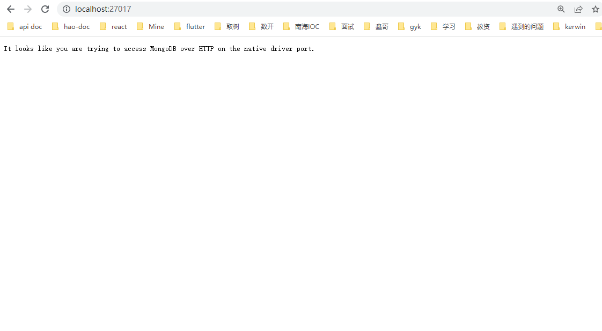

### Mongodb 配置

```bash
1.安装，配置环境变量
2.mongo --version
3.mongod.exe --dbpath="C:\Users\qiu\Desktop\nodejs\24-Express-cli\db" // 在安装mongodb的bin目录下，指定数据库存放目录，不可关闭，关闭即表示关闭服务器，每次都要先使用这条命令打开mongodb数据库，dbpath是db目录
4.mongo.exe // 客户端，测试数据库是否已开启，可以执行mongo指令
```

### Mongodb 数据库存放在 24-Express-cli/db 下

检查数据库是否启用成功


<hr>

### Mongodb 命令行

```bash
help      // 帮助命令

show dbs  // 查看数据库，除了三个默认的数据库，其他的需要有集合才能查询到
use db   // 没有就创建数据库，有就切换
db       // 查看当前所在的数据库

db.createCollection("users") // 创建集合=表
db.getCollectionNames()      // 查看集合
db.test.drop()               // 删除某个集合，test是集合名

db.test.save({ username: 'qiu', age: 12 })          // 插入一条文档数据
db.test.save([{ username: 'qiu', age: 12 }, { username: 'qiuli', age: 12 }]) // 插入多条文档数据
db.test.remove({ age: 12 })                         // 删除匹配检索的文档数据
db.test.remove({})                                  // 删除文档全部数据
db.test.updata({username: 'qiuli'},{age: 100})      // 直接替换,只剩 age: 100，没有username了
db.test.updata({ username: 'qiuli' }, {$set: { age: 12 }})   // 修改username=qiuli的集合的age=12
db.test.update({ username: 'qiuli' }, {$unset: { age: 12 }})  // 去除username=qiuli的集合的age这一列
db.test.update({ username: 'qiuli' }, {$inc: { age: 10 }})   // 修改username=qiuli的集合的age在原基础上+10
db.test.update({ username: 'qiuli' }, {$inc: { age: -10 }})  // 修改username=qiuli的集合的age在原基础上-10
db.test.find()                          // 查询test集合的文档
db.test.find({ username:'qiuli' })      // 带条件的查询
db.test.find({ age:{$gt:20 } })         // gt:大于20  gte:大于等于20  gte:greater than equal
db.test.find({ age:{$lt:20 } })         // lt:小于20  lte:小于等于20  lte:less than equal
db.test.find({ age:{$lt,100,$gt:20 } }) // 大于20且小于100的
db.test.find({ $or:[{age:1},{age:2}] }) // 1或者2的年龄
db.test.find({ username:/q/ })          // 模糊查询，使用正则
db.test.find({},{ username: 1, _id: 0 })// 查询指定字段  1-想要这个字段  0-不想要这个字段
db.test.find({}).limit(5)                 // 前5条
db.test.find({}).skip(pageNum - 1 * 5).limit(5)    // 查询第几页数据，一页返回5条
db.test.find({}).sort({age:1})           // 升序
db.test.find({}).sort({age:-1})          // 降序
db.test.find({}).count()                 // 计数
db.test.find({}).sort({age:1}).skip(0).limit(2).count()   // 方法可以连用
```

### Mongodb 与 MySQL 区别

|         | MySQL                        | Mongodb                                |
| ------- | ---------------------------- | -------------------------------------- |
| 类型    | 关系型                       | 非关系型                               |
| 区别    | 字段有明确的类型及字段名限制 | 没有类型限制，可以随意插入不同的字段名 |
| 库      | database                     | database                               |
| 表/集合 | table                        | collection                             |
| 行/文档 | row                          | document                               |
| 列/字段 | column                       | field                                  |

<hr>

### Express + MongoDB 开发

### 1.启动 MongoDB 服务器

```bash
mongod.exe --dbpath="C:\Users\qiu\Desktop\nodejs\24-Express-cli\db"
```

### 2.安装必要的依赖

```bash
npm i mongoose -S
```

### 3.配合 MongoDB Compass 使用，需要在命令行先创建数据库，往数据库里插集合，然后可以选择导入外部文件，或者在 Compass 插入，或者代码插入


- MongoDB Compass 导入外部 json 文件，使用命令导入：

```bash
# 在Mongodb的安装bin目录下，运行
mongoimport --host localhost --port 27017 --db gyk_mongodb --collection user --file "F:\gky\gky-mongodb\大作业\CMS\myapp\dbdata\user.json"
# gyk_mongodb：数据库名
# user：集合名
# "F:\gky\gky-mongodb\大作业\CMS\myapp\dbdata\user.json"：json文件存放路径
```

```json
{
  "name": "baby",
  "gender": 1,
  "phone": "13926753538",
  "birth": "1998-05-27",
  "avatar": ""
}
```

- MongoDB Compass 导入 jsonArray 文件，使用命令导入：

```bash
mongoimport --host localhost --port 27017 --db gyk_mongodb --collection city --file "F:\gky\gky-mongodb\大作业\CMS\myapp\dbdata\city.json" --jsonArray
```

```json
[
  { "cityId": 110100, "name": "北京", "pinyin": "beijing", "isHot": 1 },
  { "cityId": 310100, "name": "上海", "pinyin": "shanghai", "isHot": 1 },
  { "cityId": 440100, "name": "广州", "pinyin": "guangzhou", "isHot": 1 },
  { "cityId": 440300, "name": "深圳", "pinyin": "shenzhen", "isHot": 1 }
]
```

### 4.node 操作 Mongodb，利用 mongoose 模型工具

- mongoose 连接 mongodb 数据库

```js
// 1.新建config/db.config.js
const mongoose = require('mongoose');

/**
 * 连接mongodb，连接成功返回一个promise对象
 */
mongoose
  .connect('mongodb://127.0.0.1:27017/nodejs_users')
  .then(() => {
    console.log('成功连接mogodb数据库');
  })
  .catch((err) => {
    console.log(err);
  });
// 2.app.js引入
require('./config/db.config.js'); // 连接mongodb
```

<hr>

- 创建模型

```js
// 2.新建model/userModel.js，把数据库的字段映射过来
/**
 * 创建用户模型并导出
 * Schema - 对应mongodb中field
 * Model - 对应mongodb中collection
 */
const mongoose = require('mongoose');

const userSchema = new mongoose.Schema({
  username: String,
  password: String,
  age: Number,
});

// 模型为user，创建出来后集合名为users，此处在mongodb里面必须取名为users表
const UserModel = mongoose.model('user', userSchema);

module.exports = UserModel;
```

<hr>

- 通过 Model 操作数据库 crud，遵循 restful 规范

  - restful 规范：接口路径没有动词，只有名词，用一个名词代替 crud 所有接口，但是使用不同的请求方法

```js
// 新增
router.post('/', function (req, res, next) {
  const { username, password, age } = req.body;
  UserModel.create({
    username,
    password,
    age,
  })
    .then((data) => {
      res.send({ ok: 1 });
    })
    .catch((err) => {
      res.send({ ok: 0 });
    });
});

// 删除 deleteOne deleteMany
router.delete('/:id', function (req, res, next) {
  const { id } = req.params;
  UserModel.deleteOne({ _id: id })
    .then((data) => {
      res.send({ ok: 1 });
    })
    .catch((err) => {
      res.send({ ok: 0 });
    });
});

// 更新 updateOne updateMany
router.put('/:id', function (req, res, next) {
  const { id } = req.params;
  const { username, password, age } = req.body;
  UserModel.updateOne(
    { _id: id },
    {
      username,
      password,
      age,
    }
  )
    .then((data) => {
      res.send({ ok: 1 });
    })
    .catch((err) => {
      res.send({ ok: 0 });
    });
});

/**
 * 查询所有  UserModel.find()
 * 查询指定字段   UserModel.find({}, ['username', 'age'])
 * 查询总数  UserModel.find({}, ['username', 'age']).count()
 * 待条件查询  UserModel.find({ age: 21 })
 * 排序 UserModel.find({}, ['username', 'age']).sort({ age: 1 })
 * 分页 UserModel.find({}).sort({ age: 1 }).skip((pageNum - 1) * pageSize).limit(pageSize)
 */
router.get('/', async function (req, res, next) {
  const { pageNum, pageSize } = req.query;
  const data = await UserModel.find({})
    .sort({ age: 1 })
    .skip((pageNum - 1) * pageSize)
    .limit(pageSize);
  const totalCount = await UserModel.find({}, ['username', 'age']).count();
  res.send({
    data,
    totalCount,
  });
});
```

<hr >

#### 4.使用 MVC 架构

- M 层 model ：接收 C 层传过来的参数，与数据库交互，返回给 C 层，使用 mongooes 有 model 模型层，所以这里的 M 层可以由 servicces 代替

- V 层 view ：前端视图渲染

- C 层 Controller ：接收前端换过来的参数，再传给 M 层，转发接口结果给 V 层
