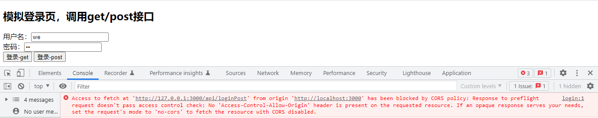

### 遇到的问题：

#### 问：1、https://dreport.meituan.net<POST method>，POST 方法，这个接口的 Content-Type = 'application/octet-stream'，我们在 node 里面使用 http.request 请求这个接口的数据的时候，body 的传参格式是怎样的？

#### 答：查了百度，问了泽钦，在 node 里面我们写 Content-Type = 'application/json'，body 传参使用 json 格式即可。

#### 问：2、18-路由那一章

#### 前端使用 fetch 请求 nodejs 的接口，是 POST 的请求方式，body 是 json 的格式，也就是 Content-Type 是 application/json 的格式，但是在发送的时候，数据发送不到服务器并报出了如下错误：

#### 参考这篇文章：[参考文章](https://blog.csdn.net/weixin_34032779/article/details/89058436#:~:text=%E5%A6%82%E6%9E%9C%E4%B8%8D%E8%AE%BE%E7%BD%AE%20mode%20%EF%BC%8C%E7%9B%B4%E6%8E%A5%E8%AE%BE%E7%BD%AE%20content-type%20%E4%B8%BA%20application%2Fjson%20%EF%BC%8C%E5%88%99,fetch%20%E4%BC%9A%E9%BB%98%E8%AE%A4%E8%BF%99%E6%98%AF%E8%B7%A8%E5%9F%9F%E6%A8%A1%E5%BC%8F%EF%BC%88%20mode%3A%27cors%27%20%EF%BC%89%EF%BC%8C%E5%9C%A8%E8%B7%A8%E5%9F%9FPOST%E4%B9%8B%E5%89%8D%EF%BC%8C%E5%AE%A2%E6%88%B7%E7%AB%AF%E4%BC%9A%E5%85%88%E5%8F%91%E4%B8%80%E6%9D%A1%20OPTIONS%20%E8%AF%B7%E6%B1%82%E6%9D%A5%E2%80%9D%E6%8E%A2%E6%8E%A2%E8%B7%AF%E2%80%9D%EF%BC%8C%E5%A6%82%E6%9E%9C%E6%9C%8D%E5%8A%A1%E5%99%A8%E5%85%81%E8%AE%B8%EF%BC%8C%E5%86%8D%E7%BB%A7%E7%BB%AD%20POST%20%E6%95%B0%E6%8D%AE%E3%80%82)

#### fetch 如果不设置 mode，直接设置 Content-Type 为 application/json，fetch 默认会认为这是跨域模式，在跨域 POST 之前，客户端会先发一条 OPTIONS 请求，服务器允许，再继续 POST 数据。这是为了检查服务器的性能，判断发送的请求是否安全。

#### node 服务器打开的网址是 http://localhost:3000，我在前端请求 node 接口写的是http://127.0.0.1:3000，域名不同，所以跨域了，应该写作 http://localhost:3000 就不会跨域
